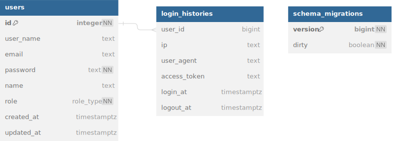

# Fashion store

## Requirements:
Develop Golang APIs for fashion store (shirt and jeans) has
following features:
* Authentication.
* Login/logout.
* Forgot password.
* Register new account.
* Add new fashion product with appropriate informations such as(`name,type, image/images (with Object Storage),price,description, etc...`).
* Update a specific fashion with id.
* Delete specific fashion with id or array of ids.
* Simple sales flow that allows shop owners to set sale coupons for a single product.
* Users can buy a product with a sales coupon.
* Logging system (to files) for every action that will occur inside of this system.

# Architecture: 
- [Microservice Architecture](https://microservices.io/i/Microservice_Architecture.png)
- [Clean architecture](https://raw.githubusercontent.com/phungvandat/clean-architecture/dev/images/clean-arch.png) 

# Database
## User service database:

## Coupon service database:

## Product service database:


# Functional flows:
## Forgot password flow:

## Reset password flow:

## Login flow:

## Functional relation of user flow:


# Built With

This section list any major frameworks/libraries used to bootstrap project.
* 
*  

## Libraries:

- Using [snowflake](github.com/bwmarrin/snowflake) engine for generate id.
- Using [paseto](github.com/o1egl/paseto) engine for generate token.
- Using [lru](github.com/hashicorp/golang-lru/v2) for in memory caching.
- Using [pq](github.com/lib/pq) for postgres driver.
- Using [cobra](github.com/spf13/cobra) for generate command line.


# Folder structure
```sh
.
├── LICENSE
├── Makefile  # using for development time.
├── README.md
├── cmd # Command line set up, load configs and init resources.
│   ├── couponManagement.go
│   ├── gateway.go
│   ├── productManagement.go
│   ├── root.go
│   ├── srv.go
│   ├── storageManagement.go
│   └── userManagement.go
├── config
│   ├── address.go
│   ├── config.go
│   └── database.go
├── development  # Deployment configurations and environments.
│   ├── coupon-management.dev.env
│   ├── dev.env
│   ├── dev.env.example
│   ├── docker-compose.yml
│   ├── gateway.dev.env
│   ├── gen-proto.sh
│   ├── init-databases
│   │   └── init-databases.sh
│   ├── migrate.sh
│   ├── postgres.Dockerfile
│   ├── product-management.dev.env
│   ├── proto.Dockerfile
│   └── user-management.dev.env
├── docs # Design and user documents
│   ├── flows
│   │   ├── forgot_password.svg
│   │   ├── functional_relation.svg
│   │   ├── login.svg
│   │   └── reset_password.svg
│   ├── html
│   │   └── html.go
│   └── markdown
├── dto # data transfer object (it is generate files from proto,thrift,etc...).
│   ├── coupon-management
│   │   └── coupon
│   │       ├── coupon.pb.go
│   │       ├── coupon.pb.gw.go
│   │       ├── coupon.pb.validate.go
│   │       ├── coupon_enums.pb.go
│   │       ├── coupon_grpc.pb.go
│   │       └── coupon_methods.pb.go
│   ├── msg
│   │   └── common
│   │       ├── forgot_password.pb.go
│   │       ├── forgot_password.pb.validate.go
│   │       ├── forgot_password_enums.pb.go
│   │       └── forgot_password_methods.pb.go
│   ├── product-management
│   │   └── product
│   │       ├── product.pb.go
│   │       ├── product.pb.gw.go
│   │       ├── product.pb.validate.go
│   │       ├── product_enums.pb.go
│   │       ├── product_grpc.pb.go
│   │       └── product_methods.pb.go
│   ├── storage-management
│   │   └── upload
│   │       ├── upload.pb.go
│   │       ├── upload.pb.gw.go
│   │       ├── upload.pb.validate.go
│   │       ├── upload_enums.pb.go
│   │       ├── upload_grpc.pb.go
│   │       └── upload_methods.pb.go
│   └── user-management
│       └── auth
│           ├── auth.pb.go
│           ├── auth.pb.gw.go
│           ├── auth.pb.validate.go
│           ├── auth_enums.pb.go
│           ├── auth_grpc.pb.go
│           └── auth_methods.pb.go
├── go.mod
├── go.sum
├── idl # interactive data language
│   └── proto # include protobuf data language
│       ├── coupon-management # protobuf files of coupon service
│       │   └── coupon.proto
│       ├── msg # protobuf files using for message queue
│       │   └── forgot_password.proto
│       ├── product-management # protobuf files of product service
│       │   └── product.proto
│       ├── storage-management # protobuf files of storage service
│       │   └── upload.proto
│       └── user-management # protobuf files of user service
│           └── auth.proto
├── internal
│   ├── coupon-management   # include business logic and repository logic of coupon service.
│   │   ├── entity # entity of coupon service.
│   │   │   ├── coupon.go
│   │   │   ├── product-coupon.go
│   │   │   ├── used-coupon.go
│   │   │   └── user-coupon.go
│   │   ├── repository # repository interfaces and repository logic of coupon service.
│   │   │   ├── coupon.go
│   │   │   ├── postgres  # repository logic in postgres database of coupon service.
│   │   │   │   ├── coupon.go
│   │   │   │   ├── product-coupon.go
│   │   │   │   ├── used-coupon.go
│   │   │   │   └── user-coupon.go
│   │   │   ├── product-coupon.go
│   │   │   ├── used-coupon.go
│   │   │   └── user-coupon.go
│   │   └── service # business logic of coupon service.
│   │       ├── coupon.go
│   │       └── coupon_test.go
│   ├── gateway # include business logic of coupon service.
│   │   ├── entity
│   │   └── service
│   │       └── file.go
│   ├── notification-management # include business logic of notification service.
│   │   ├── entity
│   │   ├── repository # repository interfaces and repository logic of notification service.
│   │   └── service # business logic of notification service.
│   │       └── notification.go
│   ├── product-management
│   │   ├── entity # entity of product service.
│   │   │   ├── product.go
│   │   │   └── purchased_product.go
│   │   ├── repository # repository interfaces and repository logic of product service.
│   │   │   ├── postgres # repository logic in postgres database of product service.
│   │   │   │   ├── product.go
│   │   │   │   └── purchased_product.go
│   │   │   ├── product.go
│   │   │   └── purchased_product.go
│   │   ├── service # business logic of product service.
│   │   │   ├── product.go
│   │   │   └── product_test.go
│   │   └── transport
│   ├── storage-management
│   │   ├── entity # entity of storage service.
│   │   │   └── file.go
│   │   └── service # business logic of storage service.
│   │       └── storage.go
│   └── user-management
│       ├── entity # entity of user service.
│       │   ├── login-history.go
│       │   ├── user-history.go
│       │   └── user.go
│       ├── repository # repository interfaces and repository logic of user service.
│       │   ├── cache # repository logic in memcache of user service.
│       │   │   └── user.go
│       │   ├── es # repository logic in elasticsearch of user service.
│       │   │   └── user-history.go
│       │   ├── login-history.go
│       │   ├── postgres # repository logic in postgres database of user service.
│       │   │   ├── login-history.go
│       │   │   └── user.go
│       │   ├── user-history.go
│       │   └── user.go
│       └── service # business logic of user service.
│           ├── auth.go
│           └── auth_test.go
├── main.go # main file
├── migration # includes migration files of all services.
│   ├── coupon-management # migration files of coupon service.
│   │   └── 00001_migrate.up.sql
│   ├── product-management # migration files of product service.
│   │   └── 00001_migrate.up.sql
│   ├── storage-management # migration files of storage service.
│   │   └── 00001_migrate.up.sql
│   └── user-management # migration files of user service.
│       └── 00001_migrate.up.sql
├── mocks # mocks all interface of source (It is generate files).
│   ├── AuthService.go
│   ├── AuthServiceClient.go
│   ├── AuthServiceServer.go
│   ├── Cache.go
│   ├── Claims.go
│   ├── CouponRepository.go
│   ├── CouponServiceClient.go
│   ├── CouponServiceServer.go
│   ├── Database.go
│   ├── Entity.go
│   ├── Executor.go
│   ├── Factory.go
│   ├── IDGenerator.go
│   ├── Logger.go
│   ├── LoginHistoryRepo.go
│   ├── LoginHistoryRepository.go
│   ├── Processor.go
│   ├── ProductCouponRepository.go
│   ├── ProductRepository.go
│   ├── ProductServiceClient.go
│   ├── ProductServiceServer.go
│   ├── Provider.go
│   ├── Publisher.go
│   ├── PurchasedProductRepository.go
│   ├── Storage.go
│   ├── Subscriber.go
│   ├── Tx.go
│   ├── UnsafeAuthServiceServer.go
│   ├── UnsafeCouponServiceServer.go
│   ├── UnsafeProductServiceServer.go
│   ├── UnsafeUploadServiceServer.go
│   ├── UploadService.go
│   ├── UploadServiceClient.go
│   ├── UploadServiceServer.go
│   ├── UploadService_UploadClient.go
│   ├── UploadService_UploadServer.go
│   ├── UsedCouponRepository.go
│   ├── UserCacheRepo.go
│   ├── UserCacheRepository.go
│   ├── UserCouponRepository.go
│   ├── UserHistoryRepo.go
│   ├── UserHistoryRepository.go
│   ├── UserRepository.go
│   ├── isCreateCouponRequest_ApplyId.go
│   ├── isUploadRequest_Data.go
│   ├── mapMetaDataFunc.go
│   ├── middlewareFunc.go
│   └── number.go
├── pkg # include all utility and functional which help to development.
│   ├── cache # include cache interface.
│   │   └── cache.go
│   ├── crypto_util # include password utility and generate code string.
│   │   └── util.go
│   ├── database # include database interface and database utility.
│   │   ├── executor.go
│   │   ├── tx.go
│   │   └── util.go
│   ├── email # include email utility.
│   │   ├── provider.go
│   │   └── smtp.go
│   ├── file_util # include file utility.
│   │   └── util.go
│   ├── grpc_client # include grpc client utility.
│   │   └── client.go
│   ├── grpc_server # include grpc server utility.
│   │   ├── grpc.go
│   │   └── health_check.go
│   ├── http_server # include http server utility.
│   │   ├── common.go
│   │   ├── http_server.go
│   │   ├── metadata.go
│   │   └── xcontext
│   │       ├── context.go
│   │       └── ctx.go
│   ├── id_utils # include id utility.
│   │   ├── id.go
│   │   └── snowflake.go
│   ├── logger # include logger interface.
│   │   └── logger.go
│   ├── lru # include memcache with lru(least recently used) strategy.
│   │   └── cache.go
│   ├── pg_util # include postgres utility.
│   │   └── type.go
│   ├── postgres_client # include postgres client factory.
│   │   └── postgres.go
│   ├── processor # include processor,factory interface,
│   │   └── processor.go
│   ├── pubsub # include pubsub interface.
│   │   ├── publisher.go
│   │   └── subscriber.go
│   ├── reflect_util # include reflect utility.
│   │   ├── util.go
│   │   └── util_test.go
│   ├── storage # include storage interface.
│   │   └── storage.go
│   ├── string_util # include string utility.
│   │   └── util.go
│   └── token_util # include token utility.
│       └── jwt.go
└── tools # Supporting tools for this project
    └── protoc-gen-custom # append some custom generate protobuf files which help development.
        ├── internal
        │   └── generator.go
        └── main.go

87 directories, 188 files
```


# Prerequisites

- Make sure you have Go installed ([download](https://golang.org/dl/)). Version `1.21` or higher is required.
- Docker (version `20.10.22+`)
- Make (containing shell commands).

# Getting started
First of all, we should set up environments:

environment variables:
```
I already set up variables for develop environment.So we no need do anything.
```

1. Starting database:

```sh
  make start-postgres
```

2. Migrate:

```sh
  make migrate-all
```

3. Generate protobuf:

```sh
  make gen-proto
```

4. Simple start 4 services with dev environment:

```sh
  make start-user-dev
  make start-product-dev
  make start-coupon-dev
  make start-gateway-dev
```

# Unit test
```sh
  make gen-mock
```

start all unit test:
```sh
  make test
```


# Conclusion:
I was do many things and features, so i don't have many time for done at all. If i have more time what i will do:

- [ ] Build transaction between multi-services (using saga architecture).
- [ ] Develop wallet features for user.
- [ ] Done notification service includes send email flow.
- [ ] Done upload service includes upload files flow.
- [ ] Verify logout token in Gateway service.
- [ ] Caching user token logout in Gateway service to optimization.

